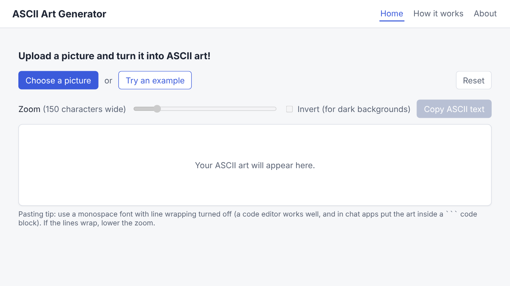
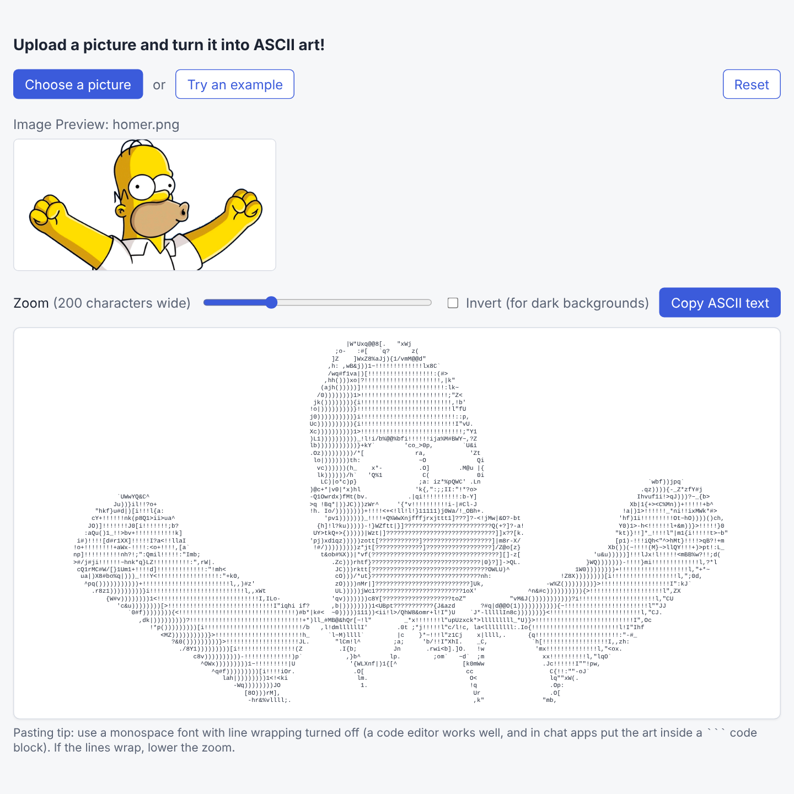
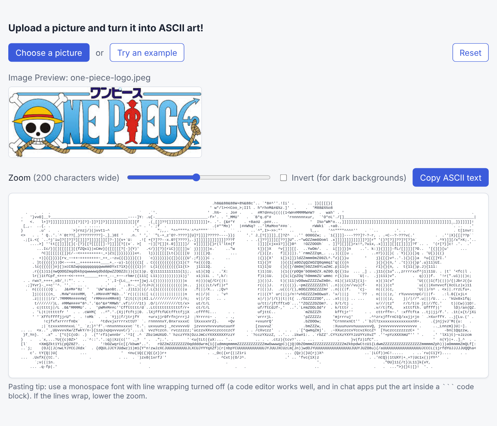
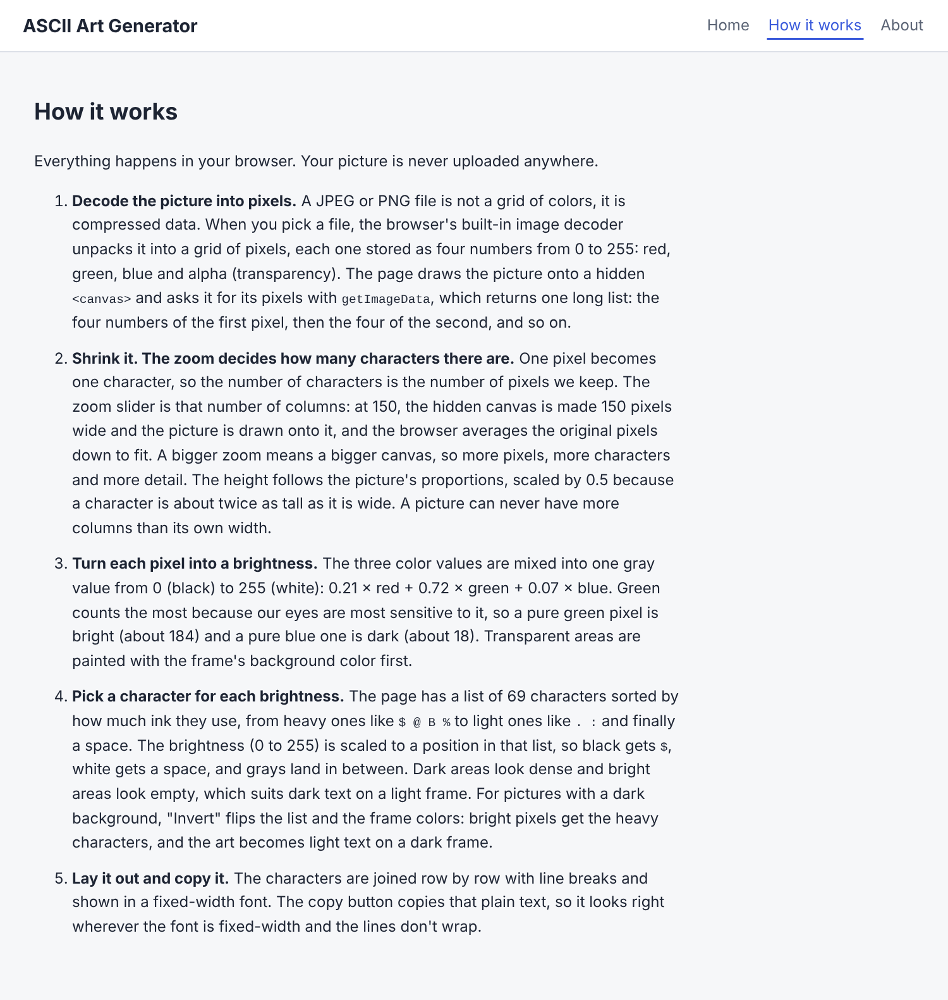

# ASCII Art Generator

Upload an image and turn it into ASCII art!

Deployed on Netlify: [ASCII Art Generator](https://mp-ascii-art-generator.netlify.app/)

<figure>
    
</figure>

---

## Features

* **Upload a picture** or **try the built-in example** with one click.
* **Zoom slider:** the bigger the zoom, the more characters wide the art is, so the more detail it has. The art updates live while you drag.
* **Invert mode:** swaps the characters and the frame colors, for pictures with dark backgrounds (light text on a dark frame).
* **Copy ASCII text** to paste the art anywhere. Use a monospace font with line wrapping turned off, or put it inside a code block in chat apps.
* **Reset** to start over with the default settings.
* **Private:** everything runs in your browser, so your pictures are never uploaded.
* **How it works** and **About** pages.

---

## How it works

1. The browser decodes the image file into pixels (red, green, blue and alpha values), and the picture is drawn onto a hidden `<canvas>`.
2. The canvas is sized to the zoom value: one pixel becomes one character. Rows are scaled by 0.5 because a character is about twice as tall as it is wide.
3. Each pixel's color is turned into a brightness from 0 to 255: `0.21 × red + 0.72 × green + 0.07 × blue`.
4. The brightness is matched to a list of 69 characters sorted from dense (`$`, `@`, `B`) to light (`.`, space), and the characters are laid out row by row in a monospace font.

The [How it works](https://mp-ascii-art-generator.netlify.app/how) page explains each step in more detail.

---

## Preview

<figure>
    <figcaption>Homer Simpson from The Simpsons, using the example button.</figcaption>
    
</figure>
<br>
<figure>
    <figcaption>One Piece Anime Logo.</figcaption>
    
</figure>
<br>
<figure>
    <figcaption>The "How it works" page.</figcaption>
    
</figure>
<br>

---

## Technologies Used

* HTML/CSS
* JavaScript
* React and React Router
* Canvas API
* Create React App

---

## Run Locally

```
npm install
npm start
```

The app opens at `http://localhost:3000`. To create a production build, run `npm run build`.

---

### Resources

- [Tutorial for this Project](https://www.jonathan-petitcolas.com/2017/12/28/converting-image-to-ascii-art.html)
- [Animating a Canvas with React Hooks](http://www.petecorey.com/blog/2019/08/19/animating-a-canvas-with-react-hooks/)
- [Canvas with React.js](https://medium.com/@pdx.lucasm/canvas-with-react-js-32e133c05258)
